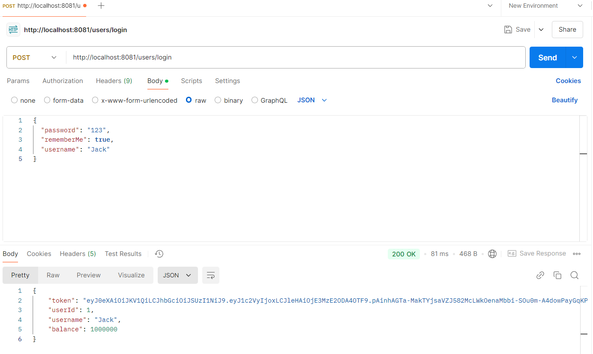
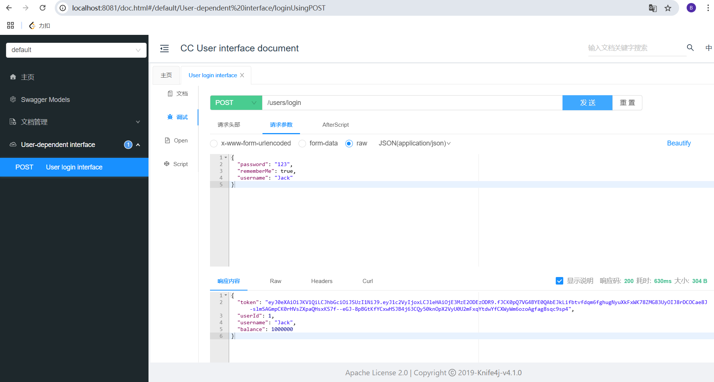
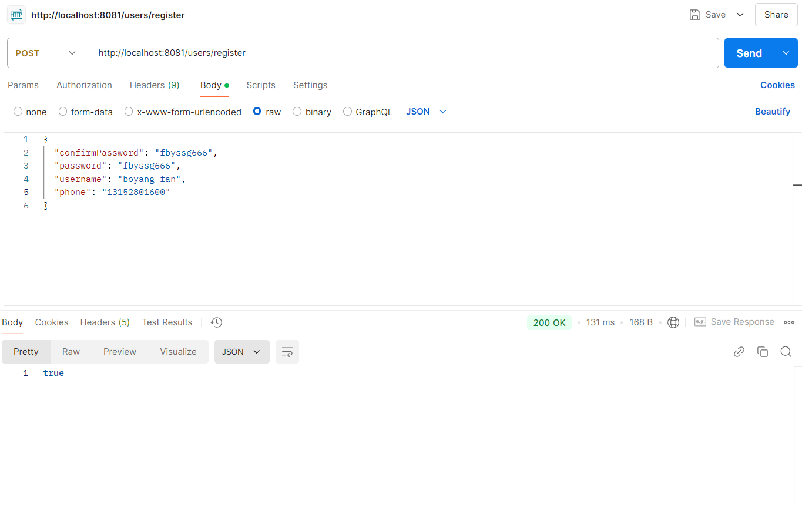
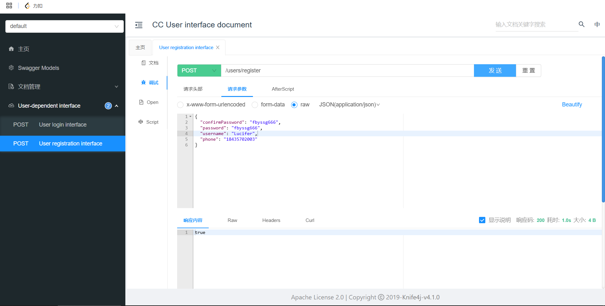
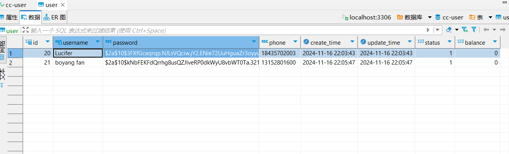

## 2024/11/14

### 1. User Module

#### 1.1 User database design

```sql
CREATE TABLE `user`  (
  `id` bigint NOT NULL AUTO_INCREMENT,
  `username` varchar(50) CHARACTER SET utf8 COLLATE utf8_general_ci NOT NULL COMMENT '用户名',
  `password` varchar(128) CHARACTER SET utf8 COLLATE utf8_general_ci NOT NULL COMMENT '密码，加密存储',
  `phone` varchar(20) CHARACTER SET utf8 COLLATE utf8_general_ci NULL DEFAULT NULL COMMENT '注册手机号',
  `create_time` datetime NOT NULL COMMENT '创建时间',
  `update_time` datetime NOT NULL,
  `status` int NULL DEFAULT 1 COMMENT '使用状态（1正常 2冻结）',
  `balance` int NULL DEFAULT NULL COMMENT '账户余额',
  PRIMARY KEY (`id`) USING BTREE,
  UNIQUE INDEX `username`(`username`) USING BTREE
) ENGINE = InnoDB AUTO_INCREMENT = 19 CHARACTER SET = utf8 COLLATE = utf8_general_ci COMMENT = '用户表' ROW_FORMAT = COMPACT;
```

```sql
CREATE TABLE IF NOT EXISTS `address` (
  `id` bigint NOT NULL AUTO_INCREMENT,
  `user_id` bigint DEFAULT NULL COMMENT '用户ID',
  `province` varchar(10) CHARACTER SET utf8 COLLATE utf8_general_ci DEFAULT NULL COMMENT '省',
  `city` varchar(10) CHARACTER SET utf8 COLLATE utf8_general_ci DEFAULT NULL COMMENT '市',
  `town` varchar(10) CHARACTER SET utf8 COLLATE utf8_general_ci DEFAULT NULL COMMENT '县/区',
  `mobile` varchar(255) CHARACTER SET utf8 COLLATE utf8_general_ci DEFAULT NULL COMMENT '手机',
  `street` varchar(255) CHARACTER SET utf8 COLLATE utf8_general_ci DEFAULT NULL COMMENT '详细地址',
  `contact` varchar(255) CHARACTER SET utf8 COLLATE utf8_general_ci DEFAULT NULL COMMENT '联系人',
  `is_default` varchar(1) CHARACTER SET utf8 COLLATE utf8_general_ci DEFAULT NULL COMMENT '是否是默认 1默认 0否',
  `notes` varchar(255) CHARACTER SET utf8 COLLATE utf8_general_ci DEFAULT NULL COMMENT '备注',
  PRIMARY KEY (`id`) USING BTREE,
  KEY `user_id` (`user_id`) USING BTREE
) ENGINE=InnoDB AUTO_INCREMENT=64 DEFAULT CHARSET=utf8mb3 ROW_FORMAT=COMPACT;
```


## 2024/11/15

### 1. User Model

#### 1.1 Login

- **postman test**



- **Swagger**




## 2024/11/16

### 1. User Model

#### 1.1 Register

- **postman**



- **Swagger**




- **mysql**


